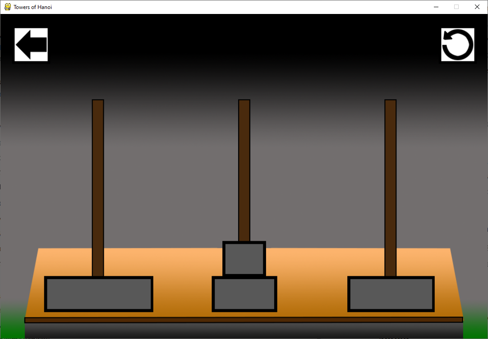
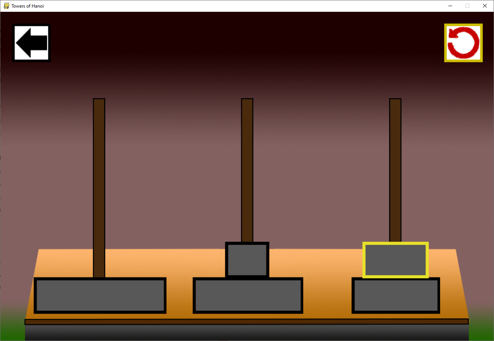
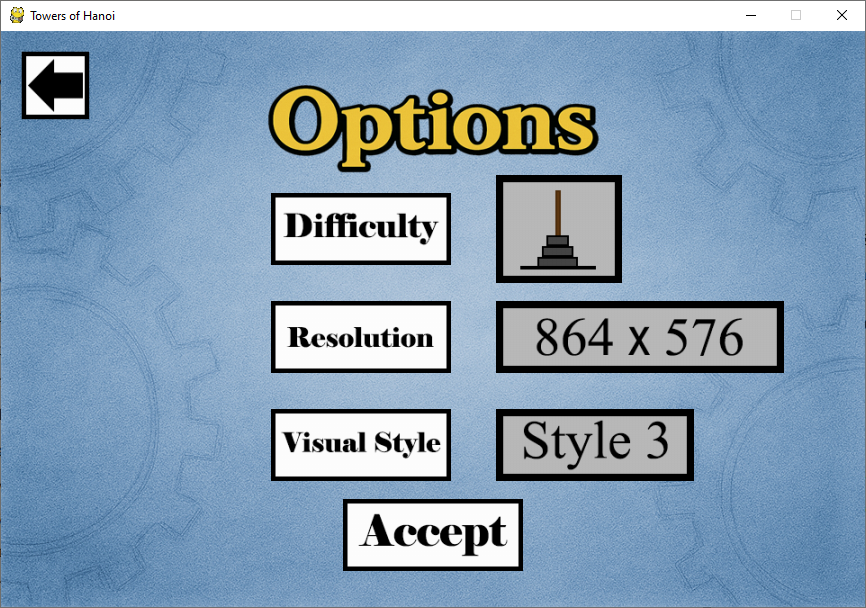

# Tower of Hanoi

A classic Tower of Hanoi puzzle game implemented in Python using Pygame.

## Description

This game is an implementation of the classic Tower of Hanoi logic puzzle. Players must move a stack of discs from one rod to another, following these rules:
- Only one disc can be moved at a time
- Each move consists of taking the upper disc from one stack and placing it on top of another stack or an empty rod
- No disc may be placed on top of a smaller disc

## Features

- Variable difficulty: Choose between 3-5 discs
- Three themed asset sets for different visual experiences
- Five resolution options to fit your display preferences
- In-game options menu to modify settings while playing
- Intuitive click-and-click gameplay
- Built-in tutorial slideshow for new players

## Installation

Simply download and run the .exe file. No additional installation required.

## How to Play

1. Click on a tower to select a disc
2. Click on another tower to move the disc
3. Complete the puzzle by moving all discs to the target tower

## Customization

Access the in-game options menu to:
- Change the number of discs (3-5)
- Select a different visual theme
- Adjust the screen resolution

## Screenshots

## Author

Daniel Q. Lewis
